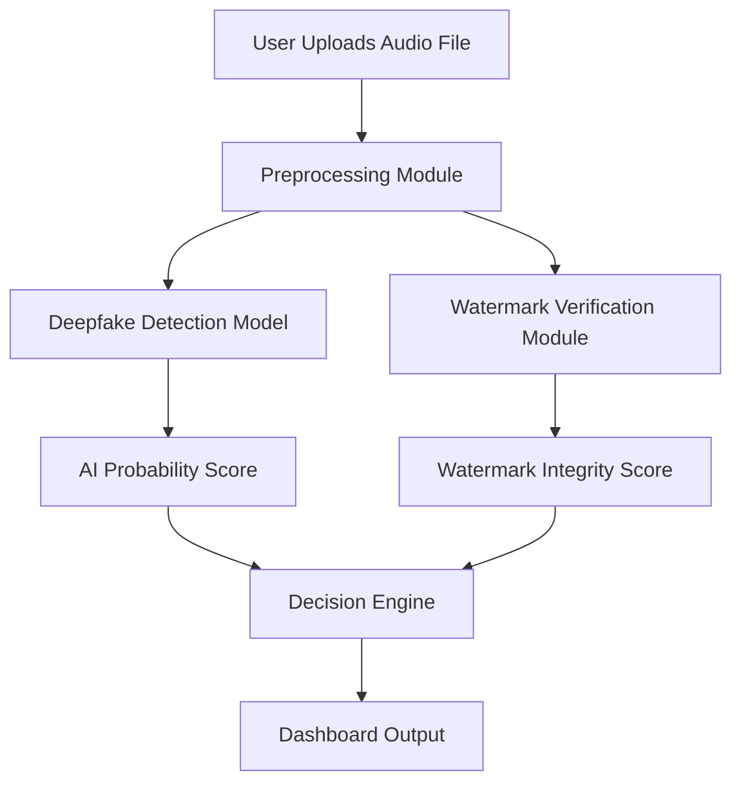

# Voxie – AI-Powered Audio Authenticity Verification Framework

#### Demo Link - [Link to be added]
#### Demo Video - [Link to be added]
#### PPT Link - [Link to be added]

## Problem Statement

Advancements in AI voice synthesis have made it possible to generate highly realistic cloned audio. Deepfake voice technology can now impersonate executives, manipulate public opinion, and compromise legal evidence.

There is currently no widely adopted system that:

- Verifies whether an audio file is authentic or AI-generated
- Embeds secure, inaudible authenticity markers
- Detects tampering or manipulation
- Provides verifiable confidence scoring

As synthetic media becomes more accessible, trust in digital voice content is eroding.

---

## Our Solution

**Voxie** is a two-layer voice authenticity framework designed to:

1. Detect AI-generated audio using a pretrained deepfake detection model
2. Embed and verify spectral watermarks using FFT-based frequency domain techniques

This dual-layer approach enables both:
- Synthetic voice detection
- Authenticity verification of original recordings

---

## Vision

To build a trusted digital voice ecosystem where every audio file can be verified, authenticated, and trusted in an era of AI-generated media.

---

## How It Works

### Layer 1 – AI Deepfake Detection
- Uses a pretrained Wav2Vec2-based classifier
- Analyzes uploaded audio
- Outputs authenticity probability score
- Classifies audio as Real or AI-Generated

### Layer 2 – Spectral Watermark Verification
- Embeds an inaudible binary signature in the mid-frequency band
- Uses Fast Fourier Transform (FFT) for spectral manipulation
- Detects watermark presence using threshold-based decoding
- Flags tampered or non-authenticated audio

---

## System Architecture



## Target Users

-  News & Media Verification Teams
-  Corporate Compliance & Finance Departments
-  Legal & Digital Forensic Experts
-  Cybersecurity & Fraud Detection Teams

---

## Tech Stack

**Backend**
- Python
- NumPy
- SciPy
- librosa
- PyTorch
- Hugging Face Transformers

**Frontend**
- Streamlit

**Model**
- `wav2vec2-deepfake-voice-detector`

**Signal Processing**
- Fast Fourier Transform (FFT)
- Spectral Magnitude Manipulation
- Threshold-Based Watermark Decoding

---

## Features

- Upload WAV or MP3 files
- Real vs AI classification
- Authenticity confidence score
- FFT-based watermark embedding
- Watermark detection & verification
- Clean dashboard interface

---

## Installation & Setup

### 1️⃣ Clone Repository
```bash
git clone https://github.com/your-username/voxie.git
cd Voxie
```
### 2️⃣ Create Virtual Environment
```bash
python -m venv venv
source venv/bin/activate  # Mac/Linux
```
### 3️⃣ Install Dependencies
```bash
pip install -r requirements.txt
```
### 4️⃣ Run Application
```bash
streamlit run app.py
```
